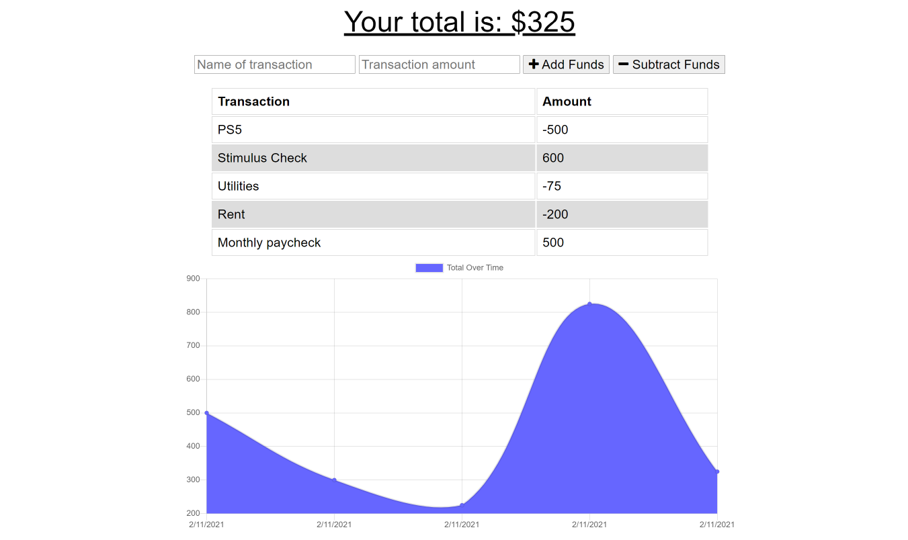

[](https://opensource.org/licenses/MIT)
# Progressive Budget Tracker

## Description

This Progressive Budget Tracker is a progressive web application that allows a user to keep track of all of their spending via their own input. This app was written using Express.js, Mongoose.js and MongoDB.


---------------------------

The deployed and functional site on Heroku can be found here: <https://pro-budget-app.herokuapp.com/>

The full process can be found on [my Github](https://github.com/spencerv86/) repository linked here:
<https://github.com/spencerv86/progressive-budget-tracker>


---------------------------

## Table of Contents

* [Installation](#installation)
* [Usage](#usage)
* [Credits](#credits)
* [License](#license)


## Installation

If you would like to inspect the code, please begin by forking the repository and downloading to your computer. Make sure that you have node already installed. 
You will likely need to run 
```npm install``` but no other files should be necessary.

If you would simply like to see the app in action, no installation is needed, just click the following link: <https://pro-budget-app.herokuapp.com/>

## Usage

To use this site, simply add and subtract your gains and expenses in the forms at the top. After each addition/subtraction, the graph below will dynamically update to show the changes in the user's cashflow over time. As a progressive web app, it is also functional if the user happens to go offline and any changes will update the database when the user returns to network.




## Credits

Thanks to the ever helpful instructional staff and members of my cohort!

## License

MIT License

Copyright (c) 2021 Spencer Vaughan

Permission is hereby granted, free of charge, to any person obtaining a copy
of this software and associated documentation files (the "Software"), to deal
in the Software without restriction, including without limitation the rights
to use, copy, modify, merge, publish, distribute, sublicense, and/or sell
copies of the Software, and to permit persons to whom the Software is
furnished to do so, subject to the following conditions:

The above copyright notice and this permission notice shall be included in all
copies or substantial portions of the Software.

THE SOFTWARE IS PROVIDED "AS IS", WITHOUT WARRANTY OF ANY KIND, EXPRESS OR
IMPLIED, INCLUDING BUT NOT LIMITED TO THE WARRANTIES OF MERCHANTABILITY,
FITNESS FOR A PARTICULAR PURPOSE AND NONINFRINGEMENT. IN NO EVENT SHALL THE
AUTHORS OR COPYRIGHT HOLDERS BE LIABLE FOR ANY CLAIM, DAMAGES OR OTHER
LIABILITY, WHETHER IN AN ACTION OF CONTRACT, TORT OR OTHERWISE, ARISING FROM,
OUT OF OR IN CONNECTION WITH THE SOFTWARE OR THE USE OR OTHER DEALINGS IN THE
SOFTWARE.